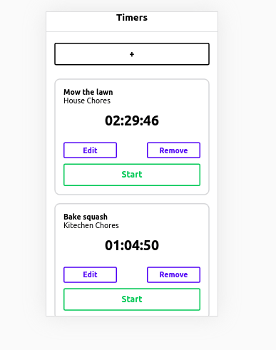

# :clock7: time-tracking

> In this app, a user can add, delete and modify various timers. 
Each timer corresponds to a different task that the user would like to keep time for

## :flashlight: Screenshot 

    

## :computer: Run as a web application   

Open your terminal/cmd and run the following commadans: 

1. type `git clone https://github.com/ahmnouira/time-tracking`.
2. `cd time-tracking` to enter to app folder.
3. `yarn` to install the app dependencies.
4. `yarn web` to view the app the browser.

